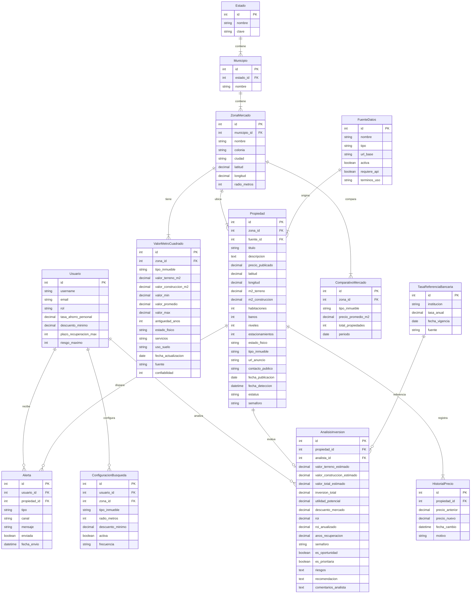

# Modelo de Base de Datos — Casa Verde

## Diagrama Entidad-Relación

## Índices recomendados

- `Propiedad(zona_id, estatus, semaforo)`
- `Propiedad(precio_publicado, fecha_deteccion)`
- `ValorMetroCuadrado(zona_id, tipo_inmueble, fecha_actualizacion)`
- `HistorialPrecio(propiedad_id, fecha_cambio)`
- `AnalisisInversion(es_oportunidad, es_prioritaria, semaforo)`