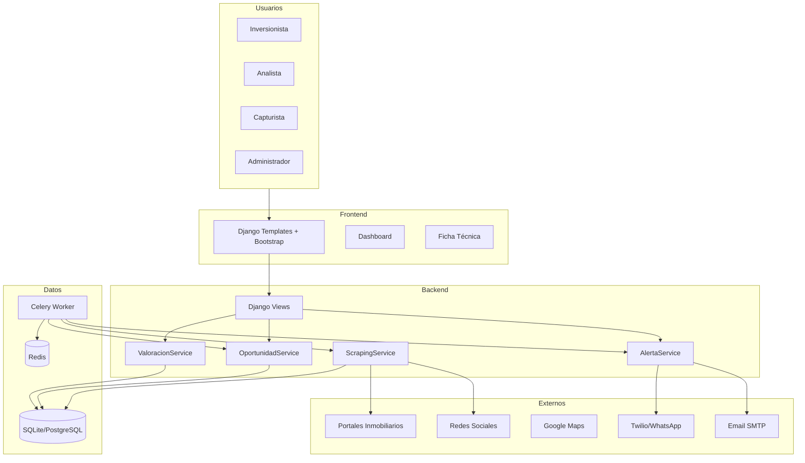
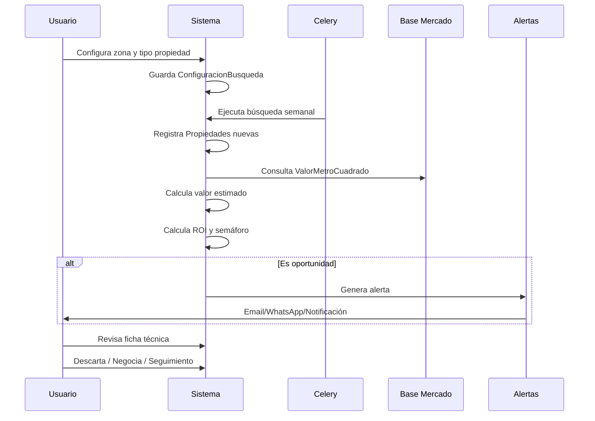

# Arquitectura del Sistema — Casa Verde

## Vista general

## Flujo de operación

## Patrones de diseño aplicados

| Patrón | Uso |
|--------|-----|
| Service Layer | Lógica de valoración y oportunidades en `services/` |
| Repository (ORM) | Django Models como capa de datos |
| Strategy | Diferentes scrapers por fuente (Fase 4) |
| Observer | Alertas al detectar oportunidades |
| Factory | Creación de análisis desde propiedad |

## Despliegue por fases

| Fase | Componentes activos |
|------|---------------------|
| 1 | Django + SQLite + Admin + Captura manual |
| 2 | + ValoracionService + AnalisisInversion |
| 3 | + Dashboard + Plotly/Chart.js |
| 4 | + Celery + Scrapers |
| 5 | + Email + Twilio |
| 6 | + Maps + PDF/Excel + Histórico |
| 7 | + ML predictivo |